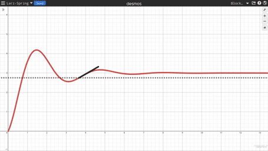

# Springy
Framerate-independent springs for everyone!



## Example in Python
```py
from spring import Spring

my_spring = Spring(0, 2) # position (0), velocity (10)

target = 4 # The target location for the spring (Equilibrium)
constant = 3 # The spring coefficient (How hard the spring tries to reach equilibrium)
dampness = 0.3 # Dampness factor of the spring (Should remain between 0 and 1 non-inclusively)

def on_update(delta_time):
	my_spring.step(target, constant, dampness, delta_time)
	
	print(my_spring.p) # Output the position!
```
